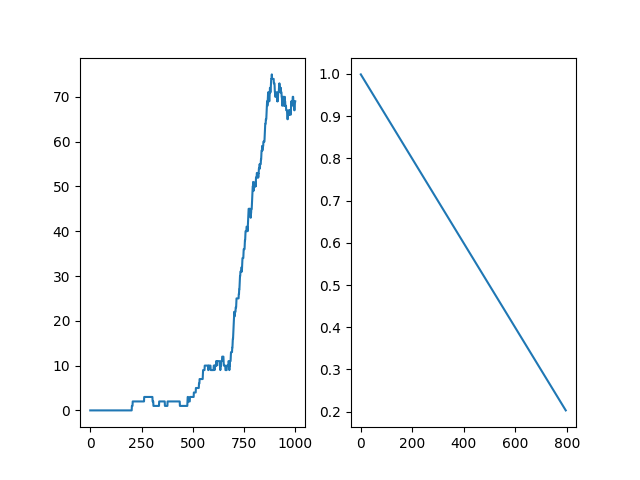

# FrozenLake Reinforcement Learning with Deep Q-Learning

This project implements a Deep Q-Learning (DQL) solution for the FrozenLake environment from OpenAI Gymnasium. The agent learns to navigate through a frozen lake environment to reach a goal while avoiding holes in the ice.

## Environment Description

In the FrozenLake environment, the agent must navigate from the starting point (S) to the goal (G) while avoiding holes (H) in the ice. The lake surface can be either slippery or non-slippery, affecting the agent's movement control.

```
SFFF    S: Start
FHFH    F: Frozen Surface
FFFH    H: Hole
HFFG    G: Goal
```

### Agent in Action


## Implementation Details

### Deep Q-Network Architecture
- Input Layer: 16 nodes (one-hot encoded state)
- Hidden Layer: 16 nodes with ReLU activation
- Output Layer: 4 nodes (Q-values for each action)

### Key Features
- Experience Replay Memory for stable learning
- Target Network for stable Q-value estimation
- Epsilon-greedy exploration strategy
- MSE Loss function for Q-value optimization

### Hyperparameters
- Learning Rate: 0.001
- Discount Factor: 0.9
- Network Sync Rate: 10 steps
- Replay Memory Size: 1000 transitions
- Mini-batch Size: 32 transitions

## Training Results



The training results show:
- Left: Average rewards over episodes (100-episode window)
- Right: Epsilon decay during training

## Requirements

```
gym
matplotlib
torch
numpy
```

## Usage

1. Install the required packages:
```bash
pip install gymnasium matplotlib torch numpy
```

2. Run the training:
```python
python frozenlake_dqn.py
```

By default, the script will:
- Load the pre-trained model and run 10 test episodes
- To train a new model, uncomment the training line in the main section

## Code Structure

- `DQN`: Neural network architecture implementation
- `ReplayMemory`: Experience replay buffer implementation
- `FrozenLakeDQL`: Main agent class implementing the DQL algorithm
  - `train()`: Training loop with experience replay
  - `test()`: Evaluation of trained policy
  - `optimize()`: Network optimization step
  - `print_dqn()`: Visualization of learned policy

## Features

- Configurable slippery/non-slippery environment
- Visual rendering during testing
- Policy visualization
- Training progress plots
- Saved model weights for quick testing